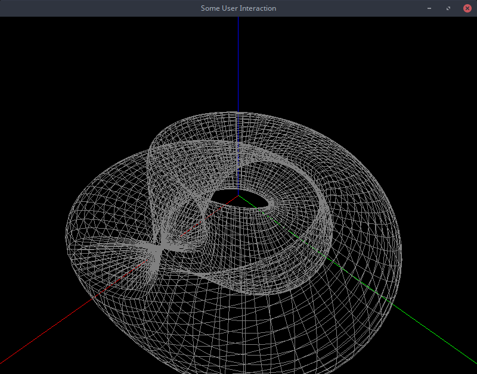
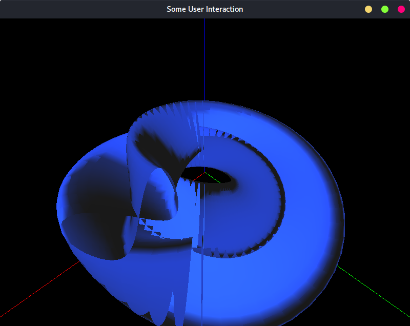
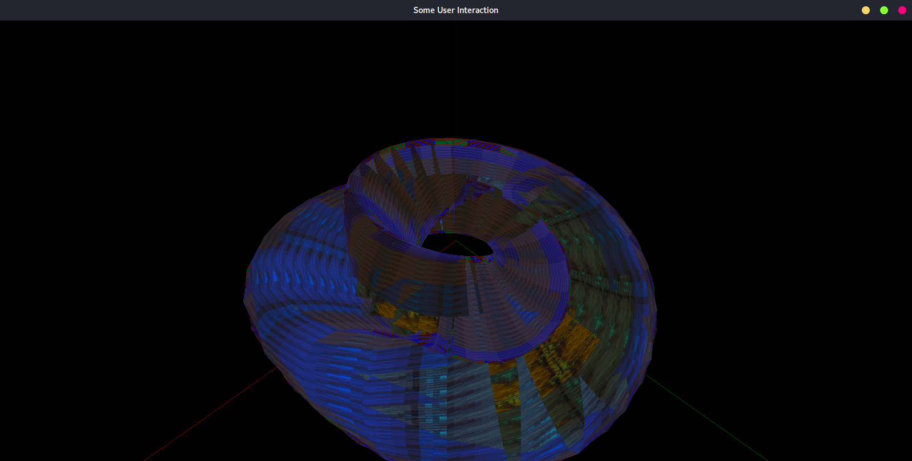
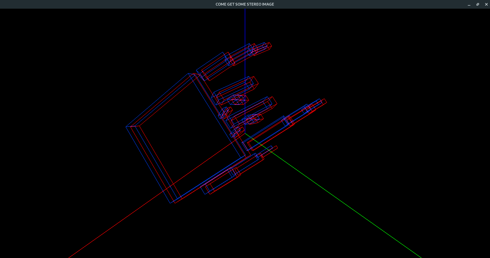

# OpenGL tasks implented in Python

### Wired Klein Bottle

 

### Surfaced Klein Bottle

 

### Textured Klein Bottle

 

### Palm

- Palm fingers is controllable via keys F1-F10
- Also palm is stereoscopic

 